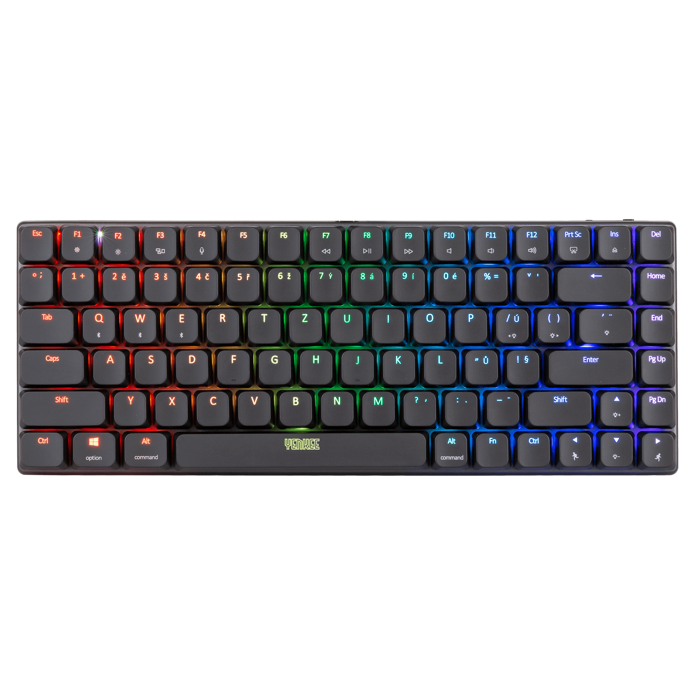
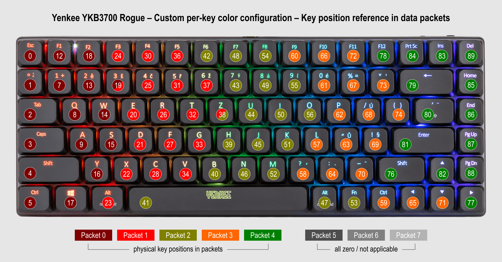

# Yenkee YKB3700 Rogue Keyboard Protocol Documentation



## Reverse Engineering Project

This comprehensive documentation is the result of meticulous reverse engineering of the Yenkee YKB3700 Rogue (OEM ROYUAN) keyboard protocol. Unlike many manufacturers who provide open APIs or cross-platform support, the vendor only offers proprietary Windows software, effectively locking out Linux, macOS, and other operating system users from customizing their RGB lighting experience.

**Our mission:** To liberate this excellent mechanical keyboard from its Windows-only shackles and empower the open-source community with complete control over its RGB lighting capabilities.

### Methodology

The protocol was reverse engineered using:
- **USBPcap** - For capturing raw USB traffic between the keyboard and official Windows software
- **Wireshark** - For detailed analysis of captured USB packets and protocol patterns
- **Systematic testing** - Methodical testing of each parameter to understand its function
- **Community collaboration** - Sharing findings and validating results across multiple keyboard units

### Documentation Structure

This documentation is divided into two main sections:

1. **Lighting Effects Protocol** - Control global effects, colors, brightness, and animation speeds
2. **Per-Key RGB Control** - Individual key color programming (see separate documentation)

### What We've Uncovered

Through careful analysis, we've successfully decoded:
- Complete packet structure for all lighting effects
- 25 different lighting modes with submode variations
- Custom RGB color implementation
- Speed and brightness control parameters
- Checksum calculation algorithm
- Proper packet sequencing and timing

### Why This Matters

This documentation enables:
- **Cross-platform support** - Linux, macOS, BSD, etc.
- **Custom software** - Create your own lighting controllers
- **Scripting integration** - Programmatic control for workflows
- **Open source projects** - Community-driven improvements
- **Long-term compatibility** - No reliance on vendor software updates

### ⚠️ Legal Notice

This documentation was created through clean-room reverse engineering for interoperability purposes. All trademarks remain property of their respective owners. This project aims to enhance user experience, not circumvent legitimate copyright protections.

*Join us in celebrating the spirit of open hardware and software freedom! Feel free to modify or for :-)*

*Continue reading to explore the complete lighting effects protocol...*

---

# Yenkee 3700 Rogue Keyboard - Communication protocols

## Lighting Effects Protocol

## Overview

This document describes the USB HID protocol for controlling RGB lighting effects, colors, brightness, and animation speed on the Yenkee 3700 Rogue keyboard.

### Packet Structure

#### Basic Format

```
07 [MODE] [SPEED] [BRIGHTNESS] [FLAGS] [RED] [GREEN] [BLUE] [CHECKSUM] [00...00]
```

#### Byte-by-Byte Breakdown

| Byte | Value | Description |
|------|-------|-------------|
| 0 | `0x07` | **COMMAND**: Always `0x07` for RGB control |
| 1 | `0x00-0x18` | **MODE**: Lighting effect type (see Mode table below) |
| 2 | `0x00-0xFF` | **SPEED**: Animation speed (meaningful range: `0x01-0x0B`) |
| 3 | `0x00-0x04` | **BRIGHTNESS**: `0x00` = Off, `0x01-0x04` = Brightness levels |
| 4 | `0x00-0x38` | **FLAGS**: Color preset or submode + custom color flag |
| 5 | `0x00-0xFF` | **RED**: Red component (only when FLAGS = `0x08`) |
| 6 | `0x00-0xFF` | **GREEN**: Green component (only when FLAGS = `0x08`) |
| 7 | `0x00-0xFF` | **BLUE**: Blue component (only when FLAGS = `0x08`) |
| 8 | `0x00-0xFF` | **CHECKSUM**: `0x100 - (sum(bytes 0-7) + 1) & 0xFF` |
| 9-63 | `0x00` | **PADDING**: Zero bytes to fill 64-byte packet |

### Mode Reference Table

| ID | Hex | Mode Name | Description | Submodes Available |
|----|-----|-----------|-------------|-------------------|
| 1 | `0x00` | Backlight OFF | Turns off all lighting | No |
| 2 | `0x01` | Static color | Solid color across all keys | No |
| 3 | `0x02` | Breathing | Pulsing fade in/out effect | No |
| 4 | `0x03` | Neon | Neon-like glow effect | No |
| 5 | `0x04` | Wave | Moving wave pattern | Yes (direction) |
| 6 | `0x05` | Waterdrop | Ripple effect on keypress | No |
| 7 | `0x06` | Rain | Falling raindrop effect | No |
| 8 | `0x07` | Snake | Snake-like moving pattern | Yes (linear/center) |
| 9 | `0x08` | Fade-out | Keys fade after press | No |
| 10 | `0x09` | Spiral | From center to sides | No |
| 11 | `0x0a` | Sinusoid | Sine wave pattern | No |
| 12 | `0x0b` | Kaleidoscope | Symmetrical pattern | Yes (from/to center) |
| 13 | `0x0c` | Linear wave | Linear wave motion | No |
| 14 | `0x0d` | User mod | WSAD + Arrows highlighted | No |
| 15 | `0x0e` | Laser | Laser beam on keypress | No |
| 16 | `0x0f` | Round wave | Circular wave pattern | Yes (direction) |
| 17 | `0x10` | Shining | Bright shining effect | No |
| 18 | `0x11` | Rain | Alternative rain effect | No |
| 19 | `0x12` | Horizontal wave | Random row wave | No |
| 20 | `0x13` | Static fade-in | Fade in on keypress | No |
| 21 | `0x14` | EDM sound reaction | Music visualization (EDM) | Yes |
| 22 | `0x15` | Unknown | "Screen1" mode in original SW | No |
| 23 | `0x16` | Standard sound reaction | Music visualization (Standard) | No |
| 24 | `0x17` | Surf/breakers | Horizontal wave breakers | No |
| 25 | `0x18` | Skew stripes | Diagonal stripe pattern | No |

### Speed Values

| Value | Effect | Notes |
|-------|--------|-------|
| `0x00` | No effect | May not work |
| `0x01` | Speed 1 | Slow |
| `0x02` | Speed 2 | Medium |
| `0x03` | Slow | Very slow |
| `0x04` | Very slow | Extremely slow |
| `0x05` | Stopped? | May pause animation |
| `0x06` | Speed 1 | Fast |
| `0x07` | Speed 2 | Faster |
| `0x08` | Speed 3 | Fast |
| `0x09` | Speed 4 | Very fast |
| `0x0a` | Speed 5 | Extremely fast |
| `0x0b` | Speed 6 | Maximum speed |
| `0x0c` | Same as `0x00` | No effect |
| `0x0d` | Similar to `0x01` | Slightly faster |

**Note:** Values above `0x0B` may work but ranges appear to repeat in blocks.

### Flags Reference

#### Basic Color Presets
| Value | Color | Example |
|-------|-------|---------|
| `0x00` | Preset Red | `07 01 00 04 00 00 00 00` |
| `0x01` | Preset Green | `07 01 00 04 01 00 00 00` |
| `0x02` | Preset Blue | `07 01 00 04 02 00 00 00` |
| `0x03` | Preset Orange | `07 01 00 04 03 00 00 00` |
| `0x04` | Preset Pink | `07 01 00 04 04 00 00 00` |
| `0x05` | Preset Yellow | `07 01 00 04 05 00 00 00` |
| `0x06` | Preset White | `07 01 00 04 06 00 00 00` |
| `0x07` | Preset Rainbow | `07 01 00 04 07 00 00 00` |
| `0x08` | Custom RGB | `07 01 00 04 08 RR GG BB` |

#### Submode Encoding
For modes with submodes (direction, pattern variation), modify the flags byte:
- `0x00-0x08`: Default submode
- `0x10-0x18`: Submode 1 (e.g., left direction)
- `0x20-0x28`: Submode 2 (e.g., down direction)  
- `0x30-0x38`: Submode 3 (e.g., up direction)

### Examples

| Description | Packet |
|-------------|--------|
| Static Custom Color (Red) | `07 01 04 04 08 ff 00 00` |
| Wave Effect with Rainbow (Right Direction) | `07 04 02 04 07 00 00 00` |
| Wave Effect with Custom Color (Left Direction) | `07 04 02 04 17 00 ff 00` |
| Wave Effect with Custom Color (Up Direction) | `07 04 02 04 38 00 ff 00` |
| Snake Effect with Custom Color | `07 07 04 04 08 ff ff 00` |
| Kaleidoscope with Rainbow | `07 0b 02 04 07 ff 45 6e` |
| Round Wave with Custom Color (Clockwise) | `07 0f 02 04 17 ff 45 6e` |

### Checksum Calculation

The checksum is calculated as:
```python
checksum = bytes([(0x100 - ((sum(main_data) + 1) & 0xFF)) & 0xFF])
```
#### Example for `07 01 04 04 08 ff 00 00`:
```
sum = 0x07 + 0x01 + 0x04 + 0x04 + 0x08 + 0xff + 0x00 + 0x00 = 279 (0x117)
sum & 0xFF = 0x17
(0x17 + 1) = 0x18
0x100 - 0x18 = 0xE8
checksum = 0xE8
```

### Sound Reaction Mode Note
When using sound reaction modes (0x14 or 0x16), the original software sends an additional sequence:
```
0d 00 00 00 00 00 00 f2 0000000000000000000000000000000000000000000000000000000000000000000000000000000000000000000000000000000000000000
```
This appears to be a SET_REPORT request for audio input configuration and requires further investigation. Not yet tested.

### Implementation Notes
- Always send complete 64-byte packets
- Use custom RGB color only when FLAGS = 0x08 (if FLAGS is not 0x08, or 0x[0-3]8 for submode, you can specify RGB values but they will be ignored)
- Submode values are mode-specific and control direction/pattern variations
- Brightness 0x00 turns off lighting regardless of other settings
- Speed values are relative and effect varies by mode

----


## User-mode Backlight Protocol - setting custom color for each key

### Overview

The Yenkee 3700 Rogue keyboard uses a proprietary USB HID protocol for RGB lighting control of each key. The protocol is optimized for 64-byte HID packets and employs advanced RGB data packing with overflow between packets.

### Protocol Structure

#### Basic Format
- **Packets per complete setup:** 7
- **Each packet size:** 64 bytes
- **Packet header:** 8 bytes
- **RGB data:** 56 bytes (with overflow)

#### Packet Headers
- Packet 0: 0c00800100000072
- Packet 1: 0c00800101000071
- Packet 2: 0c00800102000070
- Packet 3: 0c0080010300006f
- Packet 4: 0c0080010400006e
- Packet 5: 0c0080010500006d
- Packet 6: 0c0080010600006c


### Key Mapping

#### Complete Position List (0-147)

| Position | Key | Notes |
|----------|-----|-------|
| 0 | ESC | Row 1, Column 0 |
| 1 | Grave (`, ~) | Row 2, Column 0 |
| 2 | Tab | Row 3, Column 0 |
| 3 | Caps Lock | Row 4, Column 0 |
| 4 | L-Shift | Row 5, Column 0 |
| 5 | L-Ctrl | Row 6, Column 0 |
| 6 | NOT_APPLICABLE | Reserved |
| 7 | 1 | Row 2, Column 1 |
| 8 | Q | Row 3, Column 1 |
| 9 | A | Row 4, Column 1 |
| 10 | NOT_APPLICABLE | Reserved |
| 11 | NOT_APPLICABLE | Reserved |
| 12 | F1 | Row 1, Column 1 |
| 13 | 2 | Row 2, Column 2 |
| 14 | W | Row 3, Column 2 |
| 15 | S | Row 4, Column 2 |
| 16 | Z | Row 5, Column 2 |
| 17 | L-Meta (Win) | Row 6, Column 2 |
| 18 | F2 | Row 1, Column 2 |
| 19 | 3 | Row 2, Column 3 |
| 20 | E | Row 3, Column 3 |
| 21 | D | Row 4, Column 3 |
| 22 | X | Row 5, Column 3 |
| 23 | L-Alt | Row 6, Column 3 |
| 24 | F3 | Row 1, Column 3 |
| 25 | 4 | Row 2, Column 4 |
| 26 | R | Row 3, Column 4 |
| 27 | F | Row 4, Column 4 |
| 28 | C | Row 5, Column 4 |
| 29 | NOT_APPLICABLE | Reserved |
| 30 | F4 | Row 1, Column 4 |
| 31 | 5 | Row 2, Column 5 |
| 32 | T | Row 3, Column 5 |
| 33 | G | Row 4, Column 5 |
| 34 | V | Row 5, Column 5 |
| 35 | NOT_APPLICABLE | Reserved |
| 36 | F5 | Row 1, Column 5 |
| 37 | 6 | Row 2, Column 6 |
| 38 | Y | Row 3, Column 6 |
| 39 | H | Row 4, Column 6 |
| 40 | B | Row 5, Column 6 |
| 41 | Space | Row 6, Column 6 |
| 42 | F6 | Row 1, Column 6 |
| 43 | 7 | Row 2, Column 7 |
| 44 | U | Row 3, Column 7 |
| 45 | J | Row 4, Column 7 |
| 46 | N | Row 5, Column 7 |
| 47 | R-Alt | Row 6, Column 7 |
| 48 | F7 | Row 1, Column 7 |
| 49 | 8 | Row 2, Column 8 |
| 50 | I | Row 3, Column 8 |
| 51 | K | Row 4, Column 8 |
| 52 | M | Row 5, Column 8 |
| 53 | Fn | Row 6, Column 8 |
| 54 | F8 | Row 1, Column 8 |
| 55 | 9 | Row 2, Column 9 |
| 56 | O | Row 3, Column 9 |
| 57 | L | Row 4, Column 9 |
| 58 | , | Row 5, Column 9 |
| 59 | R-Ctrl | Row 6, Column 9 |
| 60 | F9 | Row 1, Column 9 |
| 61 | 0 | Row 2, Column 10 |
| 62 | P | Row 3, Column 10 |
| 63 | ; | Row 4, Column 10 |
| 64 | . | Row 5, Column 10 |
| 65 | Left | Row 6, Column 10 |
| 66 | F10 | Row 1, Column 10 |
| 67 | - | Row 2, Column 11 |
| 68 | [ | Row 3, Column 11 |
| 69 | ' | Row 4, Column 11 |
| 70 | / | Row 5, Column 11 |
| 71 | Down | Row 6, Column 11 |
| 72 | F11 | Row 1, Column 11 |
| 73 | = | Row 2, Column 12 |
| 74 | ] | Row 3, Column 12 |
| 75 | NOT_APPLICABLE | Reserved |
| 76 | R-Shift | Row 5, Column 12 |
| 77 | Right | Row 6, Column 12 |
| 78 | F12 | Row 1, Column 12 |
| 79 | Backspace | Row 2, Column 13 |
| 80 | \ | Row 3, Column 13 |
| 81 | Enter | Row 4, Column 13 |
| 82 | Up | Row 5, Column 13 |
| 83 | Ins | Row 6, Column 13 |
| 84 | PrtSc | Row 1, Column 13 |
| 85 | Home | Row 2, Column 14 |
| 86 | End | Row 3, Column 14 |
| 87 | PgUp | Row 4, Column 14 |
| 88 | PgDown | Row 5, Column 14 |
| 89 | Del | Row 6, Column 14 |
| 90-147 | NOT_APPLICABLE | Reserved |


*Reference layout of the Yenkee YKB3700 Rogue keyboard showing key indices as used in the device’s HID RGB configuration packets.*

### RGB Data Format

#### RGB Value Structure
- **3 bytes per key** in order `RR GG BB`
- **Range:** 0x00-0xFF for each component
- **Examples:** Red = `FF0000`, Green = `00FF00`, Blue = `0000FF`

#### Data Packing Algorithm

The protocol uses dynamic RGB value overflow between packets:

- Packet 0: [Header] [RGB0] [RGB1] ... [RGB17] [First 2 bytes of RGB18]
- Packet 1: [Header] [Remaining 1 byte of RGB18] [RGB19] ... [RGB35] [First 1 byte of RGB36]
- Packet 2: [Header] [Remaining 2 bytes of RGB36] [RGB37] ... [RGB54]
- ... and so on.

**Calculation for each packet:**
- 8 bytes header
- 17-18 complete RGB values (51-54 bytes)
- 0-2 bytes overflow from previous/next value
- **Always exactly 64 bytes total**

### Implementation Example

#### Generating Packets for Single Red Key

**Position 0 (ESC) red; Position 18 (F2) blue - overflowing into next Packet; others black**

*examples in brackets - see overflowing of last position from Packet0 into Packet1*
```
Packet 0: 0c00800100000072 | [ff0000] 000000 000000 000000 000000 000000 000000 000000 000000 000200 000000 000000 000000 000000 000000 000000 000000 000000 [0000
Packet 1: 0c00800101000071 | ff] 000000 000000 000000 000000 000000 000000 000000 000000 000000 020000 000000 000000 000000 000000 000000 000000 000000 000000 00
Packet 2: 0c00800102000070 | 0000 000000 000000 000000 000000 000000 000000 000000 000000 000000 000000 000000 000000 000000 000000 000000 000000 000000 000000
Packet 3: 0c00800102000070 | 000000 000000 000000 000000 000000 000000 000000 000000 000000 000000 000000 000000 000000 000000 000000 000000 000000 000000 0000
Packet 4: 0c0080010300006f | 00 000000 000000 000000 000000 000000 000000 000000 000000 000000 000000 000000 000000 000000 000000 000000 000000 000000 000000 00
Packet 5: 0c0080010400006e | 0000 000000 000000 000000 000000 000000 000000 000000 000000 000000 000000 000000 000000 000000 000000 000000 000000 000000 000000
Packet 6: 0c0080010500006d | 000000 000000 000000 000000 000000 000000 000000 000000 000000 000000 000000 000000 000000 000000 000000 000000 000000 000000 0000
Packet 7: 0c0080010600006c | 00 000000 000000 000000 000000 000000 000000 000000 000000 000000 000000 000000 000000 000000 000000 000000 000000 000000 000000 00
```

### Technical Details

#### Compatibility

- Protocol supports up to 148 key positions
- For 84-key 75% keyboard, first ~90 positions are used (including Reserved)
- Remaining positions reserved for (probably) full-size keyboards

#### Sequence Numbers

The sequence number in the header decreases with each packet (72, 71, 70, ..., 6c), likely as a security feature or integrity check.

#### Performance Optimization

- Packing into 64-byte packets maximizes HID protocol usage
- Overflow minimizes number of required packets
- One sequence of 7 packets sets entire keyboard

#### Security Warning

⚠️ Important:

- Always send complete sequence of 7 packets
- Maintain correct packet order
- Respect overflow between packets
- Test with hardware reset capability available

---

## Yenkee 3700 Rogue Keyboard Key Remapping Protocol

### Overview

This document describes the USB HID protocol for key remapping, macro assignment (not yet documented), and key disable functionality on the Yenkee 3700 Rogue keyboard. The protocol allows complete customization of the keyboard layout by reassigning scan codes and modifiers to physical key positions.

### Packet Structure

#### Basic Format
- **Total packets per configuration:** 9
- **Each packet size:** 64 bytes
- **Packet header:** `0900f801[SEQ]000000[CHECKSUM]`
- **Key data:** 14 key positions × 4 bytes each = 56 bytes

#### Packet Headers
- Packet 0: 0900f801000000fd
- Packet 1: 0900f801010000fc
- Packet 2: 0900f801020000fb
- Packet 3: 0900f801030000fa
- Packet 4: 0900f801040000f9
- Packet 5: 0900f801050000f8
- Packet 6: 0900f801060000f7
- Packet 7: 0900f801070000f6
- Packet 8: 0900f801080000f5


### Key Position Structure

Each key position uses 4 bytes in the following format:

```
[MOD2] [MOD1] [SCANCODE] [00]
```

| Byte | Description | Values |
|------|-------------|---------|
| 0 | **Second Modifier** | Modifier scan code (see table below) |
| 1 | **First Modifier** | Modifier scan code (see table below) |
| 2 | **Key Scan Code** | Primary key scan code (see table below) |
| 3 | **Terminator/Reserved** | Always `0x00` |

### Modifier Scan Codes

| Modifier | Scan Code | Description |
|----------|-----------|-------------|
| L-Ctrl | `0xe0` | Left Control |
| L-Shift | `0xe1` | Left Shift |
| L-Alt | `0xe2` | Left Alt |
| L-Meta | `0xe3` | Left Windows/Command |
| R-Ctrl | `0xe4` | Right Control |
| R-Shift | `0xe5` | Right Shift |
| R-Alt | `0xe6` | Right Alt |
| Fn | `0x0a01` | Function key (special format) |

### Important Rules

1. **Modifier Order**: Modifiers must be placed immediately before the main scan code
2. **Multiple Modifiers**: Up to 2 modifiers can be combined (order doesn't matter)
3. **Key Disable**: Use `00000000` to disable a physical key
4. **Fn Key**: Special value `0a010000` - should not be remapped
5. **Reserved Positions**: Marked as DISABLED in default mapping

### Default Key Mapping

### Packet 0 - Positions 0-13
| Pos | Physical Key | Default Mapping | Mod2 | Mod1 | Scan Code |
|-----|--------------|-----------------|------|------|-----------|
| 0 | ESC | ESC | `0x00` | `0x00` | `0x29` |
| 1 | Grave | Grave | `0x00` | `0x00` | `0x35` |
| 2 | TAB | TAB | `0x00` | `0x00` | `0x2b` |
| 3 | CAPS | CAPS | `0x00` | `0x00` | `0x39` |
| 4 | L-SHIFT | L-SHIFT | `0x00` | `0x00` | `0xe1` |
| 5 | L-CTRL | L-CTRL | `0x00` | `0x00` | `0xe0` |
| 6 | - | DISABLED | `0x00` | `0x00` | `0x00` |
| 7 | 1 | 1 | `0x00` | `0x00` | `0x1e` |
| 8 | Q | Q | `0x00` | `0x00` | `0x14` |
| 9 | A | A | `0x00` | `0x00` | `0x04` |
| 10 | \\ | \\ | `0x00` | `0x00` | `0x64` |
| 11 | - | DISABLED | `0x00` | `0x00` | `0x00` |
| 12 | F1 | F1 | `0x00` | `0x00` | `0x3a` |
| 13 | 2 | 2 | `0x00` | `0x00` | `0x1f` |

### Packet 1 - Positions 14-27
| Pos | Physical Key | Default Mapping |
|-----|--------------|-----------------|
| 14 | W | W (`0x1a`) |
| 15 | S | S (`0x16`) |
| 16 | Z | Z (`0x1d`) |
| 17 | L-META | L-META (`0xe3`) |
| 18 | F2 | F2 (`0x3b`) |
| 19 | 3 | 3 (`0x20`) |
| 20 | E | E (`0x08`) |
| 21 | D | D (`0x07`) |
| 22 | X | X (`0x1b`) |
| 23 | L-ALT | L-ALT (`0xe2`) |
| 24 | F3 | F3 (`0x3c`) |
| 25 | 4 | 4 (`0x21`) |
| 26 | R | R (`0x15`) |
| 27 | F | F (`0x09`) |

### Packet 2 - Positions 28-41
| Pos | Physical Key | Default Mapping |
|-----|--------------|-----------------|
| 28 | C | C (`0x06`) |
| 29 | - | DISABLED |
| 30 | F4 | F4 (`0x3d`) |
| 31 | 5 | 5 (`0x22`) |
| 32 | T | T (`0x17`) |
| 33 | G | G (`0x0a`) |
| 34 | V | V (`0x19`) |
| 35 | - | DISABLED |
| 36 | F5 | F5 (`0x3e`) |
| 37 | 6 | 6 (`0x23`) |
| 38 | Y | Y (`0x1c`) |
| 39 | H | H (`0x0b`) |
| 40 | B | B (`0x05`) |
| 41 | SPACE | SPACE (`0x2c`) |

### Packet 3 - Positions 42-55
| Pos | Physical Key | Default Mapping |
|-----|--------------|-----------------|
| 42 | F6 | F6 (`0x3f`) |
| 43 | 7 | 7 (`0x24`) |
| 44 | U | U (`0x18`) |
| 45 | J | J (`0x0d`) |
| 46 | N | N (`0x11`) |
| 47 | R-ALT | R-ALT (`0xe6`) |
| 48 | F7 | F7 (`0x40`) |
| 49 | 8 | 8 (`0x25`) |
| 50 | I | I (`0x0c`) |
| 51 | K | K (`0x0e`) |
| 52 | M | M (`0x10`) |
| 53 | FN | FN (`0x0a01`) |
| 54 | F8 | F8 (`0x41`) |
| 55 | 9 | 9 (`0x26`) |

### Packet 4 - Positions 56-69
| Pos | Physical Key | Default Mapping |
|-----|--------------|-----------------|
| 56 | O | O (`0x12`) |
| 57 | L | L (`0x0f`) |
| 58 | , | , (`0x36`) |
| 59 | R-CTRL | R-CTRL (`0xe4`) |
| 60 | F9 | F9 (`0x42`) |
| 61 | 0 | 0 (`0x27`) |
| 62 | P | P (`0x13`) |
| 63 | ; | ; (`0x33`) |
| 64 | . | . (`0x37`) |
| 65 | LEFT | LEFT (`0x50`) |
| 66 | F10 | F10 (`0x43`) |
| 67 | - | - (`0x2d`) |
| 68 | [ | [ (`0x2f`) |
| 69 | ' | ' (`0x34`) |

### Packet 5 - Positions 70-83
| Pos | Physical Key | Default Mapping |
|-----|--------------|-----------------|
| 70 | / | / (`0x38`) |
| 71 | DOWN | DOWN (`0x51`) |
| 72 | F11 | F11 (`0x44`) |
| 73 | = | = (`0x2e`) |
| 74 | ] | ] (`0x30`) |
| 75 | #/~ | #/~ (`0x32`) |
| 76 | R-SHIFT | R-SHIFT (`0xe5`) |
| 77 | RIGHT | RIGHT (`0x4f`) |
| 78 | F12 | F12 (`0x45`) |
| 79 | BCKSPACE | BCKSPACE (`0x2a`) |
| 80 | \\ | \\ (`0x31`) |
| 81 | ENTER | ENTER (`0x28`) |
| 82 | UP | UP (`0x52`) |
| 83 | INS | INS (`0x49`) |

### Packet 6 - Positions 84-97
| Pos | Physical Key | Default Mapping |
|-----|--------------|-----------------|
| 84 | PRTSC | PRTSC (`0x46`) |
| 85 | HOME | HOME (`0x4a`) |
| 86 | END | END (`0x4d`) |
| 87 | PGUP | PGUP (`0x4b`) |
| 88 | PGDOWN | PGDOWN (`0x4e`) |
| 89 | DEL | DEL (`0x4c`) |
| 90-97 | - | DISABLED |

### Packets 7-8 - Positions 98-125
| Pos | Physical Key | Default Mapping |
|-----|--------------|-----------------|
| 98-125 | - | DISABLED |

### Examples

#### Remap ESC to Alt+F1

Original: `00002900` → Modified: `00e23a00`

- Mod2: `0x00` (none)
- Mod1: `0xe2` (Left Alt)
- Scan Code: `0x3a` (F1)

#### Disable CAPS Lock

Original: `00003900` → Modified: `00000000`

#### Remap Q to Ctrl+Shift+T

Original: `00001400` → Modified: `e0e11700`

- Mod2: `0xe0` (Left Control)
- Mod1: `0xe1` (Left Shift) 
- Scan Code: `0x17` (T)

#### Complete Packet Example (ESC → Alt+F1) - first packet

`0900f801000000fd00e23a000000350000002b00000039000000e1000000e0000000000000001e000000140000000400000064000000000000003a0000001f00`

## Implementation Notes

- Always send all 9 packets for a complete configuration
- Maintain the exact packet order (0-8)
- Reserved positions should remain as `00000000`
- The Fn key uses special encoding and should not be remapped
- Modifiers (more than one) can be combined in any order (`e0e23a` = `e2e03a` = Ctrl+Alt+F1)

## Scan Code Reference

Common scan codes used in the default mapping:
- Letters: A=`0x04`, B=`0x05`, C=`0x06`, ..., Z=`0x1d`
- Numbers: 1=`0x1e`, 2=`0x1f`, ..., 0=`0x27`
- Function Keys: F1=`0x3a`, F2=`0x3b`, ..., F12=`0x45`
- Navigation: LEFT=`0x50`, RIGHT=`0x4f`, UP=`0x52`, DOWN=`0x51`
- Special: ENTER=`0x28`, SPACE=`0x2c`, TAB=`0x2b`, ESC=`0x29`
