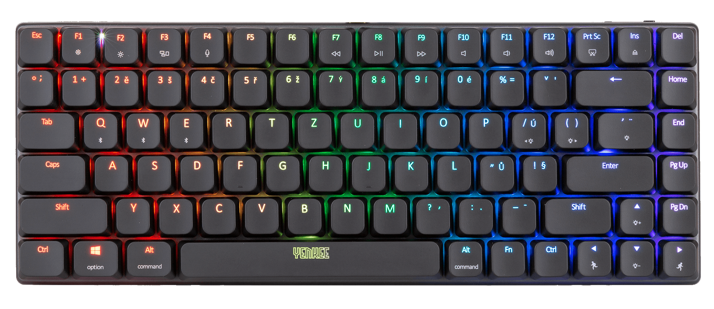

# Yenkee YKB3700 Rogue Keyboard Protocol Documentation

## Reverse Engineering Project

This comprehensive documentation and command-line utilites are the result of meticulous reverse engineering of the Yenkee YKB3700 Rogue (and probably others based on a similar ROYUAN chipset) keyboard protocol. Unlike many manufacturers who provide open APIs or cross-platform support, the vendor only offers proprietary Windows software, effectively locking out Linux, macOS, and other operating system users from customizing their RGB lighting experience.

**Our mission:** To liberate this excellent mechanical keyboard from its Windows-only shackles and empower the open-source community with complete control over its RGB lighting capabilities.

## Repository structure

### Documentation
- **[Communication Protocol](/docs/communication-protocol.md)**  
  Complete protocol documentation with uncovered commands, capabilities, and packet structures.

### Source Code
- **[YenKey Proto](/src/yenkey-proto.py)**  
  Simple prototyping script for functionality verification and packet debugging.
  *Documentation: [yenkey-proto](/docs/yenkey-proto.md)*

- **[YenKey CLI](/src/yenkey-cli.py)**  
  Complete command-line utility for backlight effects, key colors, and key remapping.
  *Documentation: [yenkey-cli](/docs/yenkey-cli.md)*

### Communication Protocol Documentation Structure

This documentation is divided into three main sections:

1. [**Lighting Effects Protocol**](/docs/communication-protocol.md#lighting-effects-protocol) - Control global effects, colors, brightness, and animation speeds
2. [**Per-Key RGB Control**](/docs/communication-protocol.md#user-mode-backlight-protocol---setting-custom-color-for-each-key) - Individual key color programming (see separate documentation)
3. [**Per-Key remapping**](/docs/communication-protocol.md#yenkee-3700-rogue-keyboard-key-remapping-protocol) - Describes the options for reassigning individual keys to different functions (e.g., sending different scancodes)

### What We've Uncovered

Through careful analysis, we've successfully decoded:
- Complete packet structure for all lighting effects
- 25 different lighting modes with submode variations
- Custom RGB color implementation for individual keys
- Key remapping implementation
- Speed and brightness control parameters
- Checksum calculation algorithm
- Proper packet sequencing and timing

### Why This Matters

This project enables:
- **Cross-platform support** - Linux, macOS, BSD, etc.
- **Custom software** - Create your own lighting controllers
- **Scripting integration** - Programmatic control for workflows
- **Open source projects** - Community-driven improvements
- **Long-term compatibility** - No reliance on vendor software updates

### ⚠️ Legal Notice

This project was created through clean-room reverse engineering for interoperability purposes. All trademarks remain property of their respective owners. This project aims to enhance user experience, not circumvent legitimate copyright protections.

*Join us in celebrating the spirit of open hardware and software freedom! **Feel free to modify or fork** :-)*
